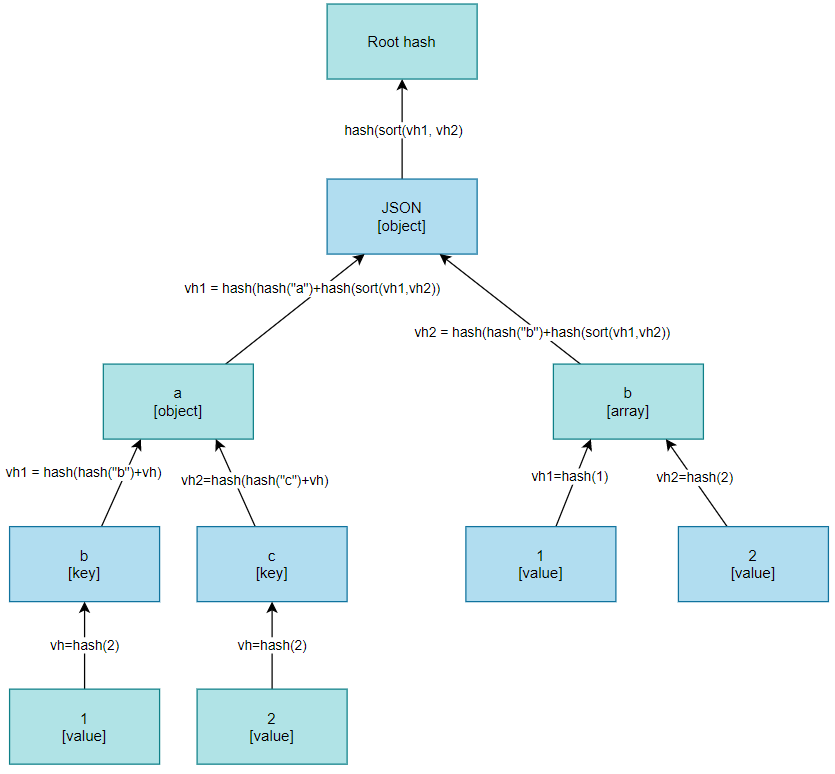

# JSON Hash in Java

## The issue with JSON serialisation

JSON can represent identical data in different ways and this is part of what makes it so useful.

Consider the following identical JSON data, formatted in three different ways:

JSON formatting for compactness:

```json
{
  "key": "9cea8d2d",
  "name": "Alice Adams",
  "age": 21
}
```

As above, but with a different member ordering:

```json
{
  "key": "9cea8d2d",
  "age": 21,
  "name": "Alice Adams"
}
```

"Pretty" JSON formatting for better human readability:

```json
{
  "key": "9cea8d2d",
  "name": "Alice Adams",
  "age": 21
}
```

If we take the above JSON strings (as ASCII or UTF-8 bytes) this will produce three different binary representations.
And if we input them into a SHA-256 computation we will get three different hashes. This means that for hash function to
work reliably and prevent false errors (hash mismatches) the JSON data must always be presented in some deterministic,
also called normalised or canonical, order.

(Source: https://connect2id.com/blog/how-to-secure-json-objects-with-hmac).

There are different solutions like the following:

* [The JSON Canonicalisation Scheme (JCS)](https://tools.ietf.org/html/rfc8785)
* [Merkle trees](https://en.wikipedia.org/wiki/Merkle_tree)

This implementation uses **Merkle tree** to build a reliable hash calculation function.

## Solution

### Process

Hash calculation is done according to the following process. Starting from root component:

1. Take the current object:
    1. If it is object, then for each entry (key-value pair):
        1. Calculate hash for key.
        2. Calculate hash for value - go to step 1.
        3. Calculate hash for entry = hash(hash(key)+hash(value)) (string concatenation).
        4. Sort hashes of all entries = hashes. Concatenate.
        5. Return hash(hashes).
    2. If it is array, then for each item:
        1. Calculate hash for item - go to step 1.
        2. Sort hashes of all items = hashes. Concatenate.
        3. Return hash(hashes).
    3. If it is primitive value (string, number, boolean), then - calculate hash of string representation.
    4. If it is _null_, return hash of empty string ("").

### Example

Lets take the following JSON as an example and calculate SHA256 hash of it:

```json
{
  "a": {
    "b": 1,
    "c": 2
  },
  "d": [
    1,
    2
  ]
}
```

The described process can be outlined using the following diagram:


#### 0 Take root object

#### 1 Take entry with key "a"

1. Calculate hash for key:

```json
{
  "ca978112ca1bbdcafac231b39a23dc4da786eff8147c4e72b9807785afee48bb": {
    "b": 1,
    "c": 2
  },
  "d": [
    1,
    2
  ]
}
```

2. Take the value as object

3. Take entry with key "b" and calculate key hash:

```json
{
  "ca978112ca1bbdcafac231b39a23dc4da786eff8147c4e72b9807785afee48bb": {
    "3e23e8160039594a33894f6564e1b1348bbd7a0088d42c4acb73eeaed59c009d": 1,
    "c": 2
  },
  "d": [
    1,
    2
  ]
}
```

4. Calculate hash for value:

```json
{
  "ca978112ca1bbdcafac231b39a23dc4da786eff8147c4e72b9807785afee48bb": {
    "3e23e8160039594a33894f6564e1b1348bbd7a0088d42c4acb73eeaed59c009d": "6b86b273ff34fce19d6b804eff5a3f5747ada4eaa22f1d49c01e52ddb7875b4b",
    "c": 2
  },
  "d": [
    1,
    2
  ]
}
```

5. Concatenate key and value hashes:

```json
{
  "ca978112ca1bbdcafac231b39a23dc4da786eff8147c4e72b9807785afee48bb": {
    "3e23e8160039594a33894f6564e1b1348bbd7a0088d42c4acb73eeaed59c009d6b86b273ff34fce19d6b804eff5a3f5747ada4eaa22f1d49c01e52ddb7875b4b",
    "c": "2"
  },
  "d": [
    1,
    2
  ]
}
```

6 Calculate hash for the entry:

```json
{
  "ca978112ca1bbdcafac231b39a23dc4da786eff8147c4e72b9807785afee48bb": {
    "adf7c66d8447bd52e7a2710d06dfb4e546ed83b7bf7a393f1f8616fd9e4663ad",
    "c": 2
  },
  "d": [
    1,
    2
  ]
}
```

7. Repeat for the next entry:

```json
{
  "ca978112ca1bbdcafac231b39a23dc4da786eff8147c4e72b9807785afee48bb": [
    "adf7c66d8447bd52e7a2710d06dfb4e546ed83b7bf7a393f1f8616fd9e4663ad",
    "82a6407e402ab1cbb29372ad0fb96c38d844bc26fd750d7ef99e426144ad5db8"
  ],
  "d": [
    1,
    2
  ]
}
```

8. **Sort** entries' hashes and concatenate them:

```json
{
  "ca978112ca1bbdcafac231b39a23dc4da786eff8147c4e72b9807785afee48bb": "adf7c66d8447bd52e7a2710d06dfb4e546ed83b7bf7a393f1f8616fd9e4663ad82a6407e402ab1cbb29372ad0fb96c38d844bc26fd750d7ef99e426144ad5db8",
  "d": [
    1,
    2
  ]
}
```

9. Calculate hash for value:

```json
{
  "ca978112ca1bbdcafac231b39a23dc4da786eff8147c4e72b9807785afee48bb": "5b20f77135a3ab5829ca82d71415dd41dddfb037ec50fef272de2358769a2cde",
  "d": [
    1,
    2
  ]
}
```

10. Calculate hash for the first entry:

```json
{
  "f36e79ca8a7259ac6caebd77cc1d7441bb3523f2b3071333435b3b01e77102a5",
  "d": [
    1,
    2
  ]
}
```

#### 2 Steps for array

1. Take the second entry and calculate hash for key "d":

```json
{
  "f36e79ca8a7259ac6caebd77cc1d7441bb3523f2b3071333435b3b01e77102a5",
  "3e23e8160039594a33894f6564e1b1348bbd7a0088d42c4acb73eeaed59c009d": [
    1,
    2
  ]
}
```

2. Calculate hashes for array's items and **sort** them:

```json
{
  "f36e79ca8a7259ac6caebd77cc1d7441bb3523f2b3071333435b3b01e77102a5",
  "3e23e8160039594a33894f6564e1b1348bbd7a0088d42c4acb73eeaed59c009d": [
    "6b86b273ff34fce19d6b804eff5a3f5747ada4eaa22f1d49c01e52ddb7875b4b",
    "d4735e3a265e16eee03f59718b9b5d03019c07d8b6c51f90da3a666eec13ab35"
  ]
}
```

3. Concatenate items' hashes:

```json
{
  "f36e79ca8a7259ac6caebd77cc1d7441bb3523f2b3071333435b3b01e77102a5",
  "3e23e8160039594a33894f6564e1b1348bbd7a0088d42c4acb73eeaed59c009d": "6b86b273ff34fce19d6b804eff5a3f5747ada4eaa22f1d49c01e52ddb7875b4bd4735e3a265e16eee03f59718b9b5d03019c07d8b6c51f90da3a666eec13ab35"
}
```

4. Calculate hash for the value:

```json
{
  "f36e79ca8a7259ac6caebd77cc1d7441bb3523f2b3071333435b3b01e77102a5",
  "3e23e8160039594a33894f6564e1b1348bbd7a0088d42c4acb73eeaed59c009d": "33b675636da5dcc86ec847b38c08fa49ff1cace9749931e0a5d4dfdbdedd808a"
}
```

5. Calculate hash for the second entry:

```json
{
  "f36e79ca8a7259ac6caebd77cc1d7441bb3523f2b3071333435b3b01e77102a5",
  "4ae84c6a3fb84c5dbe38c9e1952d96c4e59c9acf974204b988e4eceba7b1bb7d"
}
```

#### 3. Final step

1. Sort and concatenate hashes:

```json
{
  "4ae84c6a3fb84c5dbe38c9e1952d96c4e59c9acf974204b988e4eceba7b1bb7df36e79ca8a7259ac6caebd77cc1d7441bb3523f2b3071333435b3b01e77102a5"
}
```

2. Calculate final hash:

```
65dfee2163e02b70a488f20b32ea5822911d9b348a34c291d66b158b4efaf0d1
```

